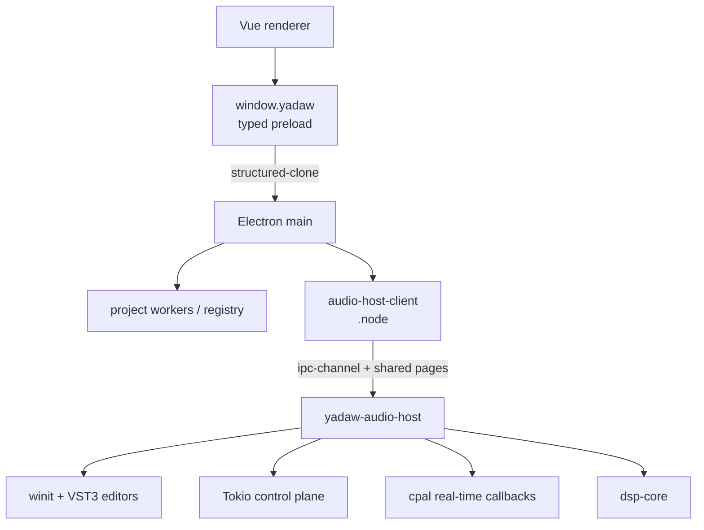

# The multiprocess design of YADAW

A DAW is not really one app with a UI glued on top. It is a control surface, a real-time engine, a plug-in host, and a persistence layer that ought to be allowed to fail without taking the open session with them. Early on we decided YADAW would lean into that reality instead of pretending everything could live in one happy address space — and that choice keeps showing up in almost every layer we touch.

## Why not Tauri

Tauri looks great on a slide: smaller binaries, system WebView, Rust on both sides of the shell. For a tool that has to feel the same on macOS, Windows, and Linux, the bargain did not survive contact with the product.

The first problem is IPC. Tauri’s path is fine for many apps, but the concrete transport, payload limits, especially for the type limitation and failure modes still wander with the platform underneath. A DAW is constantly moving structured commands, meter snapshots, plug-in state, and fat MIDI batches. We did not want our reliability story to become a permanent catalog of OS-specific edge cases.

The second is the WebView itself. Chromium-in-Electron is heavy — we know. Nobody wants to boot two super heavy V8 engines when the app starts. It is also the same rendering stack everywhere. Dense timelines, high-DPI editors, focus behavior, input timing: those are the things professional audio software lives or dies on. Spending months chasing WebKit vs. WebView2 vs. WebKitGTK differences felt like the wrong place to burn engineering time when the mixer, the graph, and the plug-in host were still unfinished.

So we took Electron: one Chromium, one Node addon boundary, a boring main/renderer split. Memory is the tax. The desktop shell stops being the experimental part of the product.

## Putting audio somewhere else

Electron main loads a native client (`.node`), but that client does not own cpal, the playback graph, or VST3 editors. It talks to `yadaw-audio-host` — a separate process whose whole job is devices, streams, the real-time graph, and plug-in windows.

We did not do that for architectural purity. A misbehaving plug-in, a host-side assertion, or a hung helper should not take down the project UI. The helper has its own epoch; when it dies, Electron main throws away every resource that belonged to that epoch and rebuilds from committed state. The renderer never gets to pretend a dead process is still “the current engine.”

There is also a quieter reason. Chromium’s heap, V8, and renderer caches are large and noisy. Keeping the audio runtime in a smaller address space means the engine’s working set is not fighting the UI for the same pages. Telemetry buffers, arenas, and graph data stay near the code that touches them every block. The host can pin control work, IPC ingress, and cpal callbacks without sharing a process with Electron’s event loop and garbage collector. Heartbeat even reports independent generations for IPC receive, Tokio dispatch, winit dispatch, and the audio callback, so a stuck editor is distinguishable from a stalled engine — which matters a lot when you are staring at a frozen UI and wondering what actually died.

The shape ends up looking like this:



Editor windows are winit top-levels owned by the helper, not Electron BrowserWindows. The desktop identity stays with Electron so the helper never becomes a second Dock or taskbar app. Click a plug-in, one typed request crosses the boundary, and the host focuses or creates the native view.

## The IPC path that is not “JSON over a pipe”

Once audio lives next door, the boring question becomes: how do you talk to it without lying about cost?

Small commands want low round-trip latency. Large blobs want bandwidth. Metering wants a path that does not schedule a request every frame. Parameter gestures want a ring the UI can write without waiting for a reply. So bootstrap opens independent normal and priority request/reply lanes, an event channel, and two persistent shared mappings — a telemetry page and a parameter SPSC ring. Priority ingress answers heartbeats from atomics and never waits for Tokio, VST3, or a full normal mailbox. When the control plane is busy, liveness still moves.

Payloads stay inline in a bounded MessagePack body up to 64 KiB. Past that they become `BinaryPayload::Shared`: the producer writes into a lazily grown arena, publishes slot metadata with release/acquire ordering, and the packet only carries a typed reference — session epoch, region, slot, offset, length, lease. Component state, waveform peaks, large MIDI batches take this path. The envelope stays small; the bytes stay in mapped memory. Each direction owns an arena with fixed region classes and a hard mapped-capacity ceiling. The sender keeps an allocation until `ReleaseLeases`. A late reader that misses its window quarantines the region instead of risking use-after-free. Exhaustion returns typed `Busy` — there is no unbounded wait queue pretending to be backpressure.

The hot UI paths mostly skip request IPC altogether. The 30 Hz meter/transport poll reads a shared telemetry page with a generation seqlock. Parameter updates go through a 4096-entry cross-process ring; a wake fires only on empty-to-non-empty. Neither invents a request/reply round trip for every twitch of a fader.

There is one place we refuse to be clever. Electron never holds an external Buffer backed by a cross-process mapping. The addon copies Node Buffer bytes into the client→host arena on the calling thread, and copies host→client arena bytes into an owned Buffer on the way back. That keeps JavaScript from mutating memory the helper still reads, and keeps Chromium’s GC out of the shared pages. Shared-memory benchmarks always include that copy. We do not market a zero-copy fantasy across the JS boundary.

And nothing in this stack runs inside the audio callback. Serialization, channel send, event construction — all of that stays on control threads. The callback reads pre-published graphs and atomics. That is the real-time rule the whole design exists to protect.

## When a call can fail without lying

Speed is useless if a lost reply leaves the session in an ambiguous state. So every YADAW call that crosses a process boundary returns a serializable result — conceptually an `RpcResult<T>` — not a thrown exception, not a rejected Promise as application control flow, not a free-form string, not a Rust panic smuggled across the wire:

```ts
type RpcResult<T> =
  | { ok: true; value: T; warnings: RpcWarning[] /* ids + revision */ }
  | { ok: false; error: RpcError }
```

Callers have to match both sides. Preload converts transport rejection into that envelope once and stops there; it does not reintroduce exception-driven control flow for application logic. Rust maps its internal `Result` to a wire error exactly once at the boundary. That is the “monad-like” part in practice: effects stay in the type, and success is never implied by “the Promise settled.”

An error is supposed to carry policy, not vibes. It has a stable code, a category, an outcome (`not-committed`, `unknown`, or `quarantined`), and a retry hint. A timeout after dispatch is `timeout-unknown`: you reconcile operation status before retrying; you do not get to assume the mutation failed.

Stateful work names its target with an opaque `ResourceRef` — kind, id, process epoch, generation — and often an expected revision. There is no protocol concept of “the current project” or “the last graph.” Restart the helper and its epoch flips; every older handle dies in one stroke.

Mutations follow prepare → commit → abort. Candidates are built under a new generation and stay invisible until one owner performs an atomic swap or durable rename. Failure before commit releases the candidate. Failure after a point where rollback is impossible quarantines the smallest affected epoch. There is no accepted “half open, assume it failed” state. Retriable mutations also carry an idempotency key scoped to the resource generation, so repeating the key returns the original terminal result instead of inventing a second one. Pinia is a revisioned projection of Electron main’s authority — never the authority itself — and sequence gaps force a fresh snapshot rather than a successful lifecycle transition dreamed up from a lonely IPC return value.

Put together, IPC reliability is not “retry until it looks fine.” It is a small state machine every boundary understands: committed, not committed, or quarantined — and a documented way back to a healthy epoch.

## What we actually bought

Electron gives us a consistent shell. The audio host gives us isolation, a quieter working set, and scheduling that respects real-time work. Shared arenas, telemetry pages, and parameter rings keep the hot control paths off the slow request lane. The typed result protocol makes every failure say what happened to the resource, not just that something went wrong.

None of that is meant to be invisible architecture. It is the reason a plug-in crash, a saturated control mailbox, or a lost reply can leave YADAW in a state we can name — and recover from — without pretending the whole application is still one process that never lies.

And Electron itself does not have to be permanent. The part we were unwilling to give up was Chromium consistency, not Node-as-the-desktop-runtime. A path that keeps looking more plausible is `winit` plus [`tauri-apps/cef-rs`](https://github.com/tauri-apps/cef-rs): same embedded Chromium discipline, but the shell owned in Rust beside the audio host instead of behind Electron’s main process. I have already put that stack through its paces in another project, [`dsh0416/godot-cef`](https://github.com/dsh0416/godot-cef), so the question is less “does CEF work from Rust?” and more “how much of our napi glue can disappear when the UI host and the audio host speak the same language.” If that migration happens, the multi-process story above mostly stays — we would just be carrying fewer Node-shaped adapters between the pieces that already matter.
